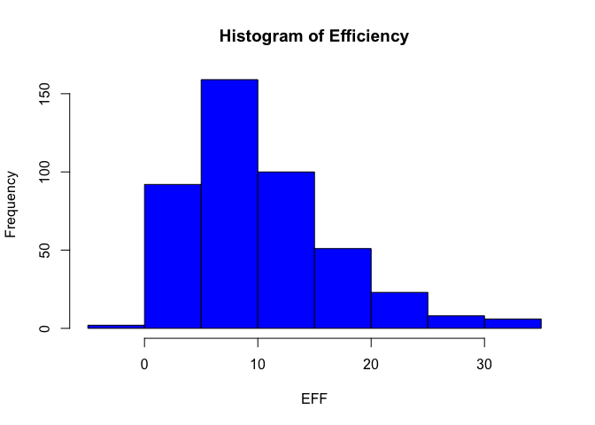
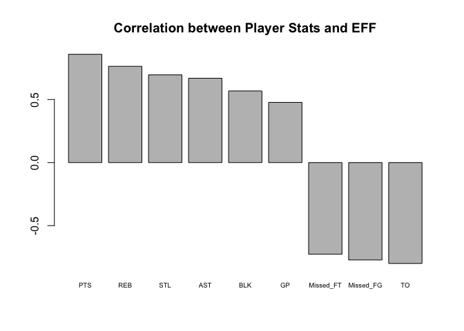
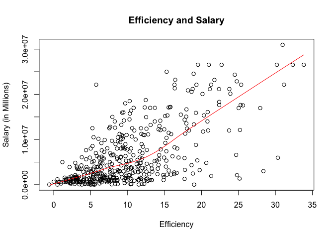
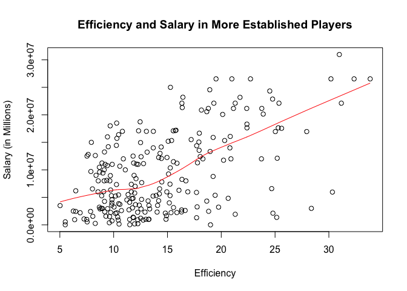

hw02-Robby-Grewal Basics of Data Frames
================

Import the Data in R\_
======================

``` r
library(dplyr)
```

    ## 
    ## Attaching package: 'dplyr'

    ## The following objects are masked from 'package:stats':
    ## 
    ##     filter, lag

    ## The following objects are masked from 'package:base':
    ## 
    ##     intersect, setdiff, setequal, union

#### .csv

``` r
dat1 <- read.csv('~/stat133/stat133-hws-fall17/hw02/data/nba2017-player-statistics.csv',
                 colClasses = c(Player="character",
                               Team="character",
                               Experience="character",
                               Position= "factor", 
                               Salary="double"))

# Check the Structure
str(dat1)
```

    ## 'data.frame':    441 obs. of  24 variables:
    ##  $ Player      : chr  "Al Horford" "Amir Johnson" "Avery Bradley" "Demetrius Jackson" ...
    ##  $ Team        : chr  "BOS" "BOS" "BOS" "BOS" ...
    ##  $ Position    : Factor w/ 5 levels "C","PF","PG",..: 1 2 5 3 4 3 4 5 4 2 ...
    ##  $ Experience  : chr  "9" "11" "6" "R" ...
    ##  $ Salary      : num  26540100 12000000 8269663 1450000 1410598 ...
    ##  $ Rank        : int  4 6 5 15 11 1 3 13 8 10 ...
    ##  $ Age         : int  30 29 26 22 31 27 26 21 20 29 ...
    ##  $ GP          : int  68 80 55 5 47 76 72 29 78 78 ...
    ##  $ GS          : int  68 77 55 0 0 76 72 0 20 6 ...
    ##  $ MIN         : int  2193 1608 1835 17 538 2569 2335 220 1341 1232 ...
    ##  $ FGM         : int  379 213 359 3 95 682 333 25 192 114 ...
    ##  $ FGA         : int  801 370 775 4 232 1473 720 58 423 262 ...
    ##  $ Points3     : int  86 27 108 1 39 245 157 12 46 45 ...
    ##  $ Points3_atts: int  242 66 277 1 111 646 394 35 135 130 ...
    ##  $ Points2     : int  293 186 251 2 56 437 176 13 146 69 ...
    ##  $ Points2_atts: int  559 304 498 3 121 827 326 23 288 132 ...
    ##  $ FTM         : int  108 67 68 3 33 590 176 6 85 26 ...
    ##  $ FTA         : int  135 100 93 6 41 649 217 9 124 37 ...
    ##  $ OREB        : int  95 117 65 2 17 43 48 6 45 60 ...
    ##  $ DREB        : int  369 248 269 2 68 162 367 20 175 213 ...
    ##  $ AST         : int  337 140 121 3 33 449 155 4 64 71 ...
    ##  $ STL         : int  52 52 68 0 9 70 72 10 35 26 ...
    ##  $ BLK         : int  87 62 11 0 7 13 23 2 18 17 ...
    ##  $ TO          : int  116 77 88 0 25 210 79 4 68 39 ...

#### \_csv

``` r
library(readr)
dat2 <- read_csv('~/stat133/stat133-hws-fall17/hw02/data/nba2017-player-statistics.csv',
                 col_types = list(Player = col_character(),
                                  Team = col_character(), 
                                  Experience = col_character(), 
                                  Position = col_factor(c(
                                    "C", "PF", "PG","SF", "SG")), 
                                  Salary= col_double()))

str(dat2)
```

    ## Classes 'tbl_df', 'tbl' and 'data.frame':    441 obs. of  24 variables:
    ##  $ Player      : chr  "Al Horford" "Amir Johnson" "Avery Bradley" "Demetrius Jackson" ...
    ##  $ Team        : chr  "BOS" "BOS" "BOS" "BOS" ...
    ##  $ Position    : Factor w/ 5 levels "C","PF","PG",..: 1 2 5 3 4 3 4 5 4 2 ...
    ##  $ Experience  : chr  "9" "11" "6" "R" ...
    ##  $ Salary      : num  26540100 12000000 8269663 1450000 1410598 ...
    ##  $ Rank        : int  4 6 5 15 11 1 3 13 8 10 ...
    ##  $ Age         : int  30 29 26 22 31 27 26 21 20 29 ...
    ##  $ GP          : int  68 80 55 5 47 76 72 29 78 78 ...
    ##  $ GS          : int  68 77 55 0 0 76 72 0 20 6 ...
    ##  $ MIN         : int  2193 1608 1835 17 538 2569 2335 220 1341 1232 ...
    ##  $ FGM         : int  379 213 359 3 95 682 333 25 192 114 ...
    ##  $ FGA         : int  801 370 775 4 232 1473 720 58 423 262 ...
    ##  $ Points3     : int  86 27 108 1 39 245 157 12 46 45 ...
    ##  $ Points3_atts: int  242 66 277 1 111 646 394 35 135 130 ...
    ##  $ Points2     : int  293 186 251 2 56 437 176 13 146 69 ...
    ##  $ Points2_atts: int  559 304 498 3 121 827 326 23 288 132 ...
    ##  $ FTM         : int  108 67 68 3 33 590 176 6 85 26 ...
    ##  $ FTA         : int  135 100 93 6 41 649 217 9 124 37 ...
    ##  $ OREB        : int  95 117 65 2 17 43 48 6 45 60 ...
    ##  $ DREB        : int  369 248 269 2 68 162 367 20 175 213 ...
    ##  $ AST         : int  337 140 121 3 33 449 155 4 64 71 ...
    ##  $ STL         : int  52 52 68 0 9 70 72 10 35 26 ...
    ##  $ BLK         : int  87 62 11 0 7 13 23 2 18 17 ...
    ##  $ TO          : int  116 77 88 0 25 210 79 4 68 39 ...
    ##  - attr(*, "spec")=List of 2
    ##   ..$ cols   :List of 24
    ##   .. ..$ Player      : list()
    ##   .. .. ..- attr(*, "class")= chr  "collector_character" "collector"
    ##   .. ..$ Team        : list()
    ##   .. .. ..- attr(*, "class")= chr  "collector_character" "collector"
    ##   .. ..$ Position    :List of 3
    ##   .. .. ..$ levels    : chr  "C" "PF" "PG" "SF" ...
    ##   .. .. ..$ ordered   : logi FALSE
    ##   .. .. ..$ include_na: logi FALSE
    ##   .. .. ..- attr(*, "class")= chr  "collector_factor" "collector"
    ##   .. ..$ Experience  : list()
    ##   .. .. ..- attr(*, "class")= chr  "collector_character" "collector"
    ##   .. ..$ Salary      : list()
    ##   .. .. ..- attr(*, "class")= chr  "collector_double" "collector"
    ##   .. ..$ Rank        : list()
    ##   .. .. ..- attr(*, "class")= chr  "collector_integer" "collector"
    ##   .. ..$ Age         : list()
    ##   .. .. ..- attr(*, "class")= chr  "collector_integer" "collector"
    ##   .. ..$ GP          : list()
    ##   .. .. ..- attr(*, "class")= chr  "collector_integer" "collector"
    ##   .. ..$ GS          : list()
    ##   .. .. ..- attr(*, "class")= chr  "collector_integer" "collector"
    ##   .. ..$ MIN         : list()
    ##   .. .. ..- attr(*, "class")= chr  "collector_integer" "collector"
    ##   .. ..$ FGM         : list()
    ##   .. .. ..- attr(*, "class")= chr  "collector_integer" "collector"
    ##   .. ..$ FGA         : list()
    ##   .. .. ..- attr(*, "class")= chr  "collector_integer" "collector"
    ##   .. ..$ Points3     : list()
    ##   .. .. ..- attr(*, "class")= chr  "collector_integer" "collector"
    ##   .. ..$ Points3_atts: list()
    ##   .. .. ..- attr(*, "class")= chr  "collector_integer" "collector"
    ##   .. ..$ Points2     : list()
    ##   .. .. ..- attr(*, "class")= chr  "collector_integer" "collector"
    ##   .. ..$ Points2_atts: list()
    ##   .. .. ..- attr(*, "class")= chr  "collector_integer" "collector"
    ##   .. ..$ FTM         : list()
    ##   .. .. ..- attr(*, "class")= chr  "collector_integer" "collector"
    ##   .. ..$ FTA         : list()
    ##   .. .. ..- attr(*, "class")= chr  "collector_integer" "collector"
    ##   .. ..$ OREB        : list()
    ##   .. .. ..- attr(*, "class")= chr  "collector_integer" "collector"
    ##   .. ..$ DREB        : list()
    ##   .. .. ..- attr(*, "class")= chr  "collector_integer" "collector"
    ##   .. ..$ AST         : list()
    ##   .. .. ..- attr(*, "class")= chr  "collector_integer" "collector"
    ##   .. ..$ STL         : list()
    ##   .. .. ..- attr(*, "class")= chr  "collector_integer" "collector"
    ##   .. ..$ BLK         : list()
    ##   .. .. ..- attr(*, "class")= chr  "collector_integer" "collector"
    ##   .. ..$ TO          : list()
    ##   .. .. ..- attr(*, "class")= chr  "collector_integer" "collector"
    ##   ..$ default: list()
    ##   .. ..- attr(*, "class")= chr  "collector_guess" "collector"
    ##   ..- attr(*, "class")= chr "col_spec"

Right After Importing the Data\_
================================

#### Replacing R with 0 and Integer Conversion in .csv and \_csv

``` r
dat1$Experience <- as.integer(replace(dat1$Experience,
                                     dat1$Experience == 'R', 0))
```

``` r
dat2$Experience <-  as.integer(replace(dat2$Experience,
                                       dat2$Experience == 'R', 0))
```

Performance of Players\_
========================

##### Adding Variables and EFF

``` r
dat1$Missed_FG <- dat1$FGA - dat1$FGM
dat1$Missed_FT <- dat1$FTA - dat1$FTM
dat1$PTS <- (dat1$Points3 *3 ) + (dat1$Points2 * 2) + dat1$FTM
dat1$REB <- dat1$OREB + dat1$DREB
dat1$MPG <- (dat1$MIN / dat1$GP)
dat1$EFF <- ((dat1$PTS + dat1$REB + dat1$AST + 
              dat1$STL+ dat1$BLK - dat1$Missed_FG -
             dat1$Missed_FT - dat1$TO) / dat1$GP)
```

#### Summary of EFF

``` r
summary(dat1$EFF)
```

    ##    Min. 1st Qu.  Median    Mean 3rd Qu.    Max. 
    ##  -0.600   5.452   9.090  10.137  13.247  33.840

Histogram of EFF & Rest of This Problem
=======================================

``` r
hist(dat1$EFF, xlab = "EFF", ylab = "Frequency", 
     main = "Histogram of Efficiency", col= "blue")
```



``` r
# Top 10 by decreasing EFF
top_ten <- dat1[order(-dat1$EFF),] [1:10,c("Player", "Team", "Salary","EFF")]
top_ten
```

    ##                    Player Team   Salary      EFF
    ## 305     Russell Westbrook  OKC 26540100 33.83951
    ## 256          James Harden  HOU 26540100 32.34568
    ## 355         Anthony Davis  NOP 22116750 31.16000
    ## 28           LeBron James  CLE 30963450 30.97297
    ## 404    Karl-Anthony Towns  MIN  5960160 30.32927
    ## 228          Kevin Durant  GSW 26540100 30.19355
    ## 74  Giannis Antetokounmpo  MIL  2995421 28.37500
    ## 359      DeMarcus Cousins  NOP 16957900 27.94118
    ## 110          Jimmy Butler  CHI 17552209 25.60526
    ## 119      Hassan Whiteside  MIA 22116750 25.36364

``` r
# Negative EFF players
filter(dat1, EFF < 0)
```

    ##            Player Team Position Experience Salary Rank Age GP GS MIN FGM
    ## 1 Patricio Garino  ORL       SG          0  31969   17  23  5  0  43   0
    ##   FGA Points3 Points3_atts Points2 Points2_atts FTM FTA OREB DREB AST STL
    ## 1   7       0            5       0            2   0   0    1    6   0   0
    ##   BLK TO Missed_FG Missed_FT PTS REB MPG  EFF
    ## 1   0  3         7         0   0   7 8.6 -0.6

``` r
# Use the function cor() to compute the correlation coefficients between EFF and all the variables used in the EFF formula
PTS = cor(dat1$EFF, dat1$PTS)
REB = cor(dat1$EFF, dat1$REB)
AST = cor(dat1$EFF, dat1$AST)
STL = cor(dat1$EFF, dat1$STL)
BLK = cor(dat1$EFF, dat1$BLK)
Missed_FG = cor(dat1$EFF, -dat1$Missed_FG)
Missed_FT = cor(dat1$EFF, -dat1$Missed_FT)
TO = cor(dat1$EFF, dat1$TO)
GP = cor(dat1$EFF, dat1$GP)

# Correlation Between Player Stats and EFF
correlation = c(PTS = cor(dat1$EFF, dat1$PTS), 
                REB = cor(dat1$EFF, dat1$REB), 
                AST = cor(dat1$EFF, dat1$AST),
                STL = cor(dat1$EFF, dat1$STL),
                BLK = cor(dat1$EFF, dat1$BLK),
                Missed_FG = -cor(dat1$EFF, dat1$Missed_FG),
                Missed_FT = -cor(dat1$EFF, dat1$Missed_FT),
                TO = -cor(dat1$EFF, dat1$TO),
                GP = cor(dat1$EFF, dat1$GP))

sorted_correlation = sort(correlation, decreasing = TRUE)
barplot(sorted_correlation, main = 'Correlation between Player Stats and EFF', cex.names = .60)
```



Efficiency and Salary
=====================

``` r
#Scatterplot
plot(dat1$EFF, dat1$Salary, main = "Efficiency and Salary", xlab = "Efficiency", ylab =  "Salary (in Millions)")
lines(lowess(dat1$EFF, dat1$Salary), col = 'red')
```



``` r
#Correlation
cor(dat1$EFF, dat1$Salary)
```

    ## [1] 0.655624

``` r
#There is a positive correlation between player efficiency and salary

#Player Data Frame
players2 <- dat1[dat1$MPG > 20,]


#Scatterplot
plot(players2$EFF, players2$Salary, main = "Efficiency and Salary in More Established Players", xlab = "Efficiency", ylab = "Salary (in Millions)")
lines(lowess(players2$EFF, players2$Salary), col = 'red')
```



``` r
cor(players2$EFF, players2$Salary)
```

    ## [1] 0.5367224

``` r
#Less correlation between salary and efficiency of more established players
```

Comments and Reflection\_
=========================

Overall, this homework was pretty straightforward, but it was a little time consuming for me to look up all the correct ways to use the functions, as I still don't feel like I have a very natural grasp of R at this point. It took me almost 8 hours to complete, and I worked with friends in the class to figure out how to tackle certain aspects such as the read.csv and read\_csv functions.
