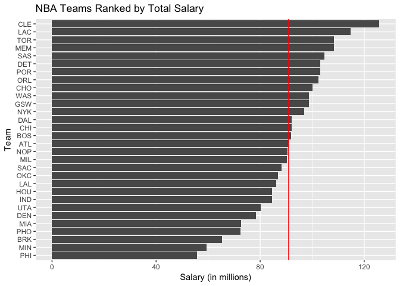
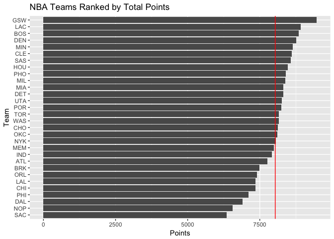
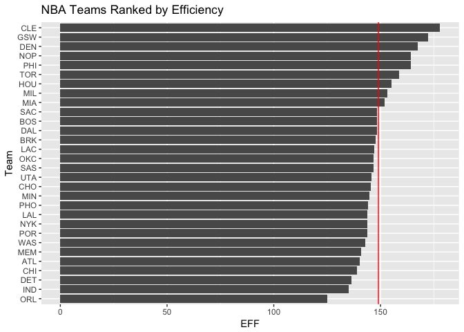
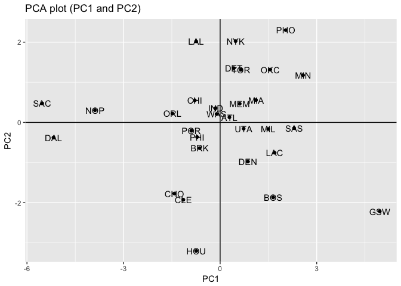
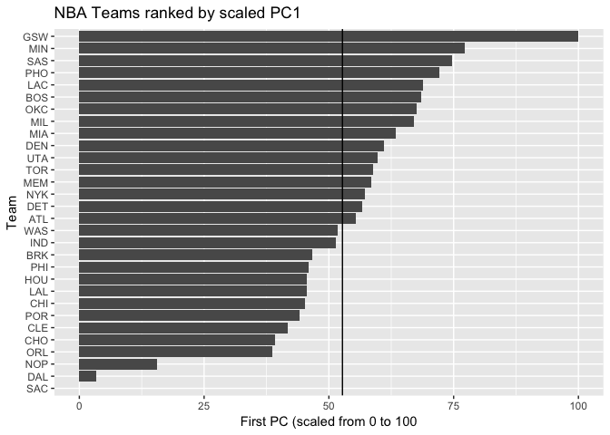

Hw03-Robby-Grewal
================
Robby Grewal

HW03 - Ranking NBA TEAMS
========================

``` r
library(dplyr)
```

    ## 
    ## Attaching package: 'dplyr'

    ## The following objects are masked from 'package:stats':
    ## 
    ##     filter, lag

    ## The following objects are masked from 'package:base':
    ## 
    ##     intersect, setdiff, setequal, union

``` r
library(ggplot2)
library(scales)
dat <- read.csv('~/stat133/stat133-hws-fall17/hw03/data/nba2017-teams.csv')
```

Ranking of Teams
----------------

### Basic Rankings

``` r
#NBA Teams Ranked by Total Salary
ggplot(dat, aes(reorder(team, salary), salary)) +
         geom_bar(stat = "identity") +
         labs(title = "NBA Teams Ranked by Total Salary", x = "Team", y = "Salary (in millions)") +
         coord_flip() +
         geom_hline(aes(yintercept = mean(salary)), col = "red")
```



``` r
#Rankings by Total Points
ggplot(dat, aes(reorder(team, points), points)) +
         geom_bar(stat = "identity") +
         labs(title = "NBA Teams Ranked by Total Points", x = "Team", y = "Points") +
         coord_flip() +
         geom_hline(aes(yintercept = mean(points)), col = "red")
```



``` r
#rankings by Efficiency
ggplot(dat, aes(reorder(team, efficiency), efficiency)) +
         geom_bar(stat = "identity") +
         labs(title = "NBA Teams Ranked by Efficiency", x = "Team", y = "EFF") +
         coord_flip() +
         geom_hline(aes(yintercept = mean(efficiency)), col = "red")
```



The first plot doesn't give much insight into the team rankings because salary doesn't have a direct effect in winning or losing games. However, teams that spend more are more likely to have better talent, and would therefore do better.

The second plot is a little more informative, as points scored directly affects a teams chance of winning games.

The third plot seems like it is the most informative, as it takes into account many different statistics covering all facets of the game.

### PCA Rankings

``` r
pca_stats <- dat %>% 
  select(points3_made, points2_made, points1_made, off_rebounds, 
         def_rebounds, assists, steals, blocks, turnovers, fouls)

pca <- prcomp(pca_stats, scale. = TRUE)
eigenvalue = pca$sdev^2
prop = round(eigenvalue/sum(eigenvalue), 4)
 cumprop = round(cumsum(prop), 4)
eig <- data.frame(eigenvalue = eigenvalue, 
                  prop = prop,
                  cumprop = cumprop
                  )
eig
```

    ##    eigenvalue   prop cumprop
    ## 1  4.69588631 0.4696  0.4696
    ## 2  1.70201009 0.1702  0.6398
    ## 3  0.97952464 0.0980  0.7378
    ## 4  0.77171938 0.0772  0.8150
    ## 5  0.53408824 0.0534  0.8684
    ## 6  0.47801622 0.0478  0.9162
    ## 7  0.38220374 0.0382  0.9544
    ## 8  0.26026243 0.0260  0.9804
    ## 9  0.13359274 0.0134  0.9938
    ## 10 0.06269622 0.0063  1.0001

``` r
pc1 <- pca$x[ ,1]
pc2 <- pca$x[ ,2]
dat$pc1 <- pc1
dat$pc2 <- pc2


#Scatterplot
ggplot(dat, aes(x = pc1, y = pc2)) +
         geom_point() +
         labs(title = "PCA plot (PC1 and PC2)", x = "PC1", y = "PC2") +
         geom_text(aes(label = dat$team)) +
         geom_hline(yintercept = 0) +
         geom_vline(xintercept = 0)
```



``` r
#Index Based on PC1

s1 <- 100 * ((pc1 - min(pc1))/(max(pc1) - min(pc1)))
dat$s1 <- s1

#barplot of PC1
ggplot(dat, aes(reorder(team, s1), s1)) +
  labs(title = "NBA Teams ranked by scaled PC1", x = "Team", y = "First PC (scaled from 0 to 100") +
  geom_bar(stat = 'identity') +
  coord_flip() +
  geom_hline(yintercept = mean(dat$s1))
```



The PC1 index provides a measure of a team's ability based on various statistics

Comment & Reflection
--------------------

No it wasn't my first time working on a project with a complex file structure. It was my first time using relative paths, and it is important so people on different machines can use the code. It wasn't my first time writing r script. Nothing was very hard, just had to look back often to find the correct syntax.
